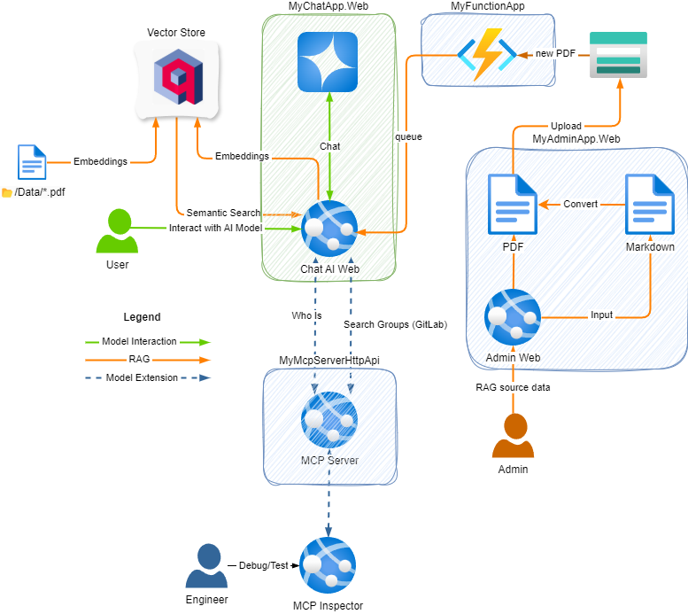

# AI Chat Application with RAG and MCP Servers

An .NET Aspire AI chat application that demonstrates how to chat with custom data (RAG - Event Driven) and context extensions (MCP Server) using an AI language model and Qdrant as the Vector Store.

>[!NOTE]
> This version does not deploy to Azure (yet). When this minor work is complete, the web applications (Chat and Admin), the MCP Server and the Functions App will all be Azure Container Apps. Functions Apps integration via .NET Aspire is still in `Preview` and the only deployment supported [currently] is to a ACA.

>[!WARNING]
> PDFs that you upload, albeit shown as a citation, they cannot be opened (yet) - **`in-progress`**

---

# Table of Contents
- [Project Overview](#project-overview)
- [Solution Structure](#solution-structure)
- [Prerequisites](#prerequisites)
- [Installation](#installation)
- [Configuration & Secrets](#configuration--secrets)
- [Usage](#usage)
- [Deployment](#deployment)
- [Troubleshooting](#troubleshooting)
- [FAQ](#faq)
- [Contributing](#contributing)
- [License](#license)
- [Acknowledgments](#acknowledgments)
- [Contact](#contact)
- [References](#references)

---

# Project Overview

AI Chat with Custom Data enables users to interact with AI models using their own data sources (RAG and MCP Server). It supports multiple providers, including GitHub Models and OpenAI endpoints.

# Features

- Interact with AI models using template provided 2x PDFs (OOB with Microsoft.Extensions.AI.Templates)
- MCP Server WhoIs tool `new`
- MCP Server GitLab SearchGroups tool (requires 2x user secrets) `new`
- Upload prewritten PDFs to use when interacting with the AI model `new`
- Dynamically create PDFs from markdown to then use when interacting with the AI Model `new`

# HLD



# Solution Structure

```
MyChatApp.sln
├── MyAdminApp.Web/
├── MyChatApp.AppHost/
├── MyChatApp.ServiceDefaults/
├── MyChatApp.Web/
├── MyFunctionApp/
└── MyMcpServerHttpApi/
```

# Prerequisites
- [.NET SDK 9.0+](https://dotnet.microsoft.com/download)

- Visual Studio 2022+ or Visual Studio Code
- GitHub Account (Copilot enabled)
- Docker for running Azurite (required for emulating Azure Blob Storage and Queues, and Azure Functions)
- (Optional, if you want to use the MCP Inspector) NodeJS
- (Optional) GitLab account if you want to use the MCP SearchGroup tool
- (Optional) [C# Dev Kit extension](https://marketplace.visualstudio.com/items?itemName=ms-dotnettools.csdevkit) for VS Code
- (Optional, for creating your own project) Install the .NET AI Template:
  ```bash
  dotnet new install Microsoft.Extensions.AI.Templates
  ```
- (Optional, for debugging and testing the MCP Server tools)
  ```bash
  npx @modelcontextprotocol/inspector dotnet run
  ```
- (Optional, for confirming blobs uploads and queues) Install the [Microsoft Azure Storage Explore](https://azure.microsoft.com/en-us/products/storage/storage-explorer)

# Installation
1. Clone the repository:
   ```bash
   git clone <your-repo-url>
   cd MyChatApp
   ```
2. Restore dependencies:
   ```bash
   dotnet restore
   ```

# Configuration & Secrets
Before running, configure API keys and endpoints for your chosen providers.

## Using GitHub Models
- Create a GitHub personal access token (PAT) with no scopes or permissions. [Guide](https://docs.github.com/en/authentication/keeping-your-account-and-data-secure/managing-your-personal-access-tokens)
- Set the secret:
  ```bash
  dotnet user-secrets set "GitHubModels:Token" "<your-token-value>"
  ```

## Using OpenAI (via Azure)
- Set the connection string:
  ```bash
  dotnet user-secrets set "ConnectionStrings:openai" "Endpoint=https://models.inference.ai.azure.com;Key=<your-token-value>"
  ```

## MyMcpServerHttpApi (GitLab)
- Set the GitLab PAT:
  ```bash
  dotnet user-secrets set "GitLab:Token" "<your-token-value>"
  ```
- Set the GitLab domain:
  ```bash
  dotnet user-secrets set "GitLab:domain" "<your-domain-value>"
  ```

> **Note:** User secrets are stored outside source control. In Visual Studio, right-click the project and select "Manage User Secrets" to edit them directly.

# Usage
## Running the Application
- **Visual Studio:**
  1. Open the `.sln` file.
  2. Press `Ctrl+F5` or click "Start".
- **Visual Studio Code:**
  1. Open the folder.
  2. Install the C# Dev Kit extension.
  3. Open `Program.cs` in `MyChatApp.AppHost`.
  4. Click "Run" in the Debug view.

## Trust the Localhost Certificate
If running for the first time, trust the self-signed development certificate:
```bash
dotnet dev-certs https --trust
```
See [Troubleshoot untrusted localhost certificate in .NET Aspire](https://learn.microsoft.com/dotnet/aspire/troubleshooting/untrusted-localhost-certificate).

## Example Prompts
1. **Markdown Table**

   Get a list of GitLab groups as a markdown table with name, web_url (as 'click me'), parent_id, and an emoji for has_subgroups. Group by parent id. Include group id in brackets after the name.

   

2. **Tree Structure**
   
   Create a tree structure nesting groups by parent id and group id.

   


3. **Dynamic PDF creation**

   Original request didn't return anything:

   

   Here I've input the markdown that was then converted to a PDF and uploaded:

   

   Here's the response after uploading the above markdown

   

# Deployment
- Standard .NET deployment applies. For cloud or container deployment, ensure secrets are set via environment variables or a secure store.

# Troubleshooting
- **Untrusted certificate:** See the [troubleshooting guide](https://learn.microsoft.com/dotnet/aspire/troubleshooting/untrusted-localhost-certificate).
- **Secrets not found:** Ensure you have set user secrets for each project as described above.
- **Microsoft Azure Storage Explorer** Install to view Blobs and Queues:
  
- **MCP Explorer** Run to debug and testing the MCP Server:
  

# FAQ
**Q: Can I use other AI providers?**
A: Yes, extend the configuration and services as needed.

**Q: Where are secrets stored?**
A: User secrets are stored outside source control in a local secrets.json file.

# Contributing
Contributions are welcome! Please open issues or submit pull requests. For major changes, open an issue first to discuss your proposal.

# License
This project is licensed under the MIT License. See [LICENSE](LICENSE) for details.

# Acknowledgments
- [.NET Aspire](https://learn.microsoft.com/dotnet/aspire/)
- [AI for .NET Developers](https://learn.microsoft.com/dotnet/ai/)
- Third-party libraries as referenced in the project

# Contact
For support or inquiries, please open an issue or contact the maintainer via GitHub.

# References
- [Announcing .NET AI Template Preview 1](https://devblogs.microsoft.com/dotnet/announcing-dotnet-ai-template-preview1/)

